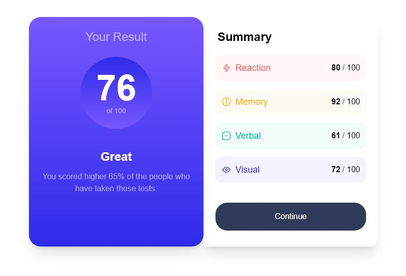

# Frontend Mentor - Results summary component solution

This is a solution to the [Results summary component challenge on Frontend Mentor](https://www.frontendmentor.io/challenges/results-summary-component-CE_K6s0maV). Frontend Mentor challenges help you improve your coding skills by building realistic projects.

## Table of contents

- [Overview](#overview)
  - [The challenge](#the-challenge)
  - [Screenshot](#screenshot)
  - [Links](#links)
- [My process](#my-process)
  - [Built with](#built-with)
  - [What I learned](#what-i-learned)
  - [Continued development](#continued-development)
  - [Useful resources](#useful-resources)
- [Author](#author)
- [Acknowledgments](#acknowledgments)

## Overview

To create a Result Summary page with mobile first thinking. Add JSON data to the Summary table.

Host a continuous deploying application in Maintel's AWS Amplify

### The challenge

Users should be able to:

- View the optimal layout for the interface depending on their device's screen size
- See hover and focus states for all interactive elements on the page

### Screenshot



### Links

- Live Site URL: [live site URL here](https://main.d3jcel33cvjcd7.amplifyapp.com/)

## My process

### Built with

- Semantic HTML5 markup
- TailwindCSS
- Flexbox
- JavaScript fetchData Function
- Mobile-first workflow
- Custom TailwindCCS

### What I learned

This was my first Frontend project, it took me about 20 hours. Which for my first project I am happy with, I learned a lot about Tailwind CSS.

Writing a seperate function too was really cool, I could grab the data from the data.json and import into my index.html

```js
fetch('/data.json')
  .then(function (response) {
    return response.json();
  })

  .then(function (data) {
    console.log(data);
    for (let i = 0; i < data.length; i++) {
      const bgcolor = data[i].bgcolor;
      const textcolor = data[i].textcolor;
      const category = data[i].category;
      const score = data[i].score;
      document.getElementById('score-list').innerHTML +=
        '<div class="flex flex-col space-y-4 p-2"></div>' +
        `<div class="flex bg-${bgcolor} justify-center items-center rounded-xl  gap-2 p-3 ">` +
        '' +
        `<div class="flex flex-col gap-1 text-lg text-${textcolor}"> ${category}  </div>` +
        '<div class="ml-auto font-bold flex items-center gap-1">' +
        score +
        ' <div class="font-normal"> / 100 </div></div>';
    }
  })
  .catch(function (err) {
    console.log(err);
  });
```

### Useful resources

Frontend Mentor Slack Channels, YouTube, TailwindCSS docs, ChatGPT

## Author

- Website - [GitHub](https://github.com/DevK-Eire)
- Frontend Mentor - [DevK-Eire](https://www.frontendmentor.io/profile/DevK-Eire)
- Twitter - [DevKEIRE](https://twitter.com/DevKEIRE)

## Acknowledgments

The Twitter community has been so supportive, warms my heart most days.
